# Progress: Document Processing Pipeline

## Current Status: Advanced Features Implemented, Optimizations Underway

The project has advanced significantly from initial design to a mature implementation with all core components and several advanced features in place. The RAG example now demonstrates practical usage with real embedding libraries, error handling, and flexible document querying. Current focus is on optimizations, streaming capability for large documents, and expanded format support.

```mermaid
flowchart LR
    Design[Design Phase] --> Sample[Sample Code] --> Implementation[Implementation] --> Debug[Debugging & Fixes] --> Testing[Testing] --> Examples[Examples] --> Advanced[Advanced Features] --> Optimization[Optimization] --> Release[Initial Release]
    
    style Design fill:#bbf,stroke:#33f,stroke-width:2px
    style Sample fill:#bbf,stroke:#33f,stroke-width:2px
    style Implementation fill:#bbf,stroke:#33f,stroke-width:2px
    style Debug fill:#bbf,stroke:#33f,stroke-width:2px
    style Testing fill:#bbf,stroke:#33f,stroke-width:2px
    style Examples fill:#bbf,stroke:#33f,stroke-width:2px
    style Advanced fill:#bbf,stroke:#33f,stroke-width:2px
    style Optimization fill:#fbb,stroke:#f33,stroke-width:2px,stroke-dasharray: 5 5
    style Release fill:#fff,stroke:#999
```

## What Works
- ✅ Document class with complete data structure and validation
- ✅ DocumentState class with equality and hash implementation
- ✅ Transition class for state transitions
- ✅ DocumentType with state machine definition and final state identification
- ✅ DocStore with SQLAlchemy backend structure (works with both SQLite and PostgreSQL)
- ✅ Parent-child relationship tracking mechanism
- ✅ Basic query capabilities for document retrieval
- ✅ State transition execution via DocStore.next()
- ✅ Comprehensive unit tests for Document classes
- ✅ Processing functions implementation (download, chunk, embed)
- ✅ Error handling for processing functions with custom error states
- ✅ Integration tests for complete pipeline
- ✅ Complete working example with full pipeline execution
- ✅ Test fixtures for all core components
- ✅ `DocStore.next` updated to accept `List[Document]` input, enabling batch processing
- ✅ Improved field naming with `media_type` instead of `content_type`
- ✅ Dedicated `url` field in Document class
- ✅ RAG example demonstrating real-world usage
- ✅ Error handling for network failures and malformed URLs
- ✅ Batch processing with mixed success/failure handling
- ✅ `DocStore.finish()` method for complete pipeline processing
- ✅ `DocStore.list()` method with flexible querying and filtering
- ✅ Real vector embedding integration using VertexAI Embeddings
- ✅ Vector storage using PGVector
- ✅ Advanced document chunking using LangChain text splitters

## In Progress
- 🔄 Streaming support for large document handling
- 🔄 Performance optimization for larger document sets
- 🔄 Comprehensive API documentation
- 🔄 Support for additional document formats

## What's Left to Build
- Streaming support for large document handling
- Concurrency improvements with asyncio.gather
- Advanced query capabilities for complex document retrieval
- Database migration strategy for schema changes
- Additional utility functions for common document operations
- Expanded documentation with detailed examples
- Monitoring system for pipeline execution
- PDF, DOCX and other document format processors

## Known Issues
- 🐛 No explicit handling for very large documents (needs streaming)
- 🐛 Database queries might not be optimized for large document sets
- 🐛 Need to improve concurrency for better performance with large document sets

## Next Milestones
1. **Performance Optimizations (Current)**
   - Implement streaming for large document handling
   - Optimize database queries
   - Implement concurrency via `asyncio.gather` in `DocStore.next`

2. **Additional Document Formats (Target: Next Sprint)**
   - PDF processor
   - DOCX processor
   - HTML processor with content extraction

3. **Robustness Improvements (Target: Next Sprint)**
   - Database migration strategy
   - Fault tolerance mechanisms
   - Recovery from failed state transitions
   - Improved logging and monitoring

4. **Documentation & Examples (Ongoing)**
   - Complete API documentation
   - Create usage examples for common scenarios
   - Add inline documentation for complex logic
   - Add RAG integration examples with different LLMs
