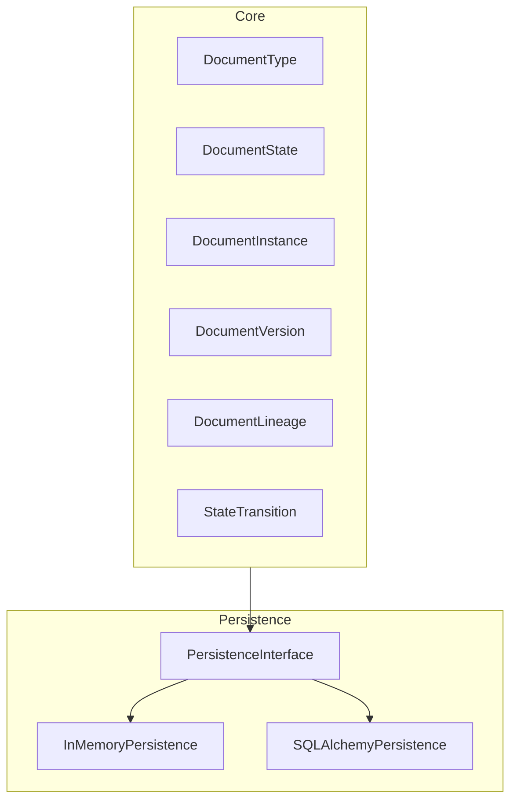
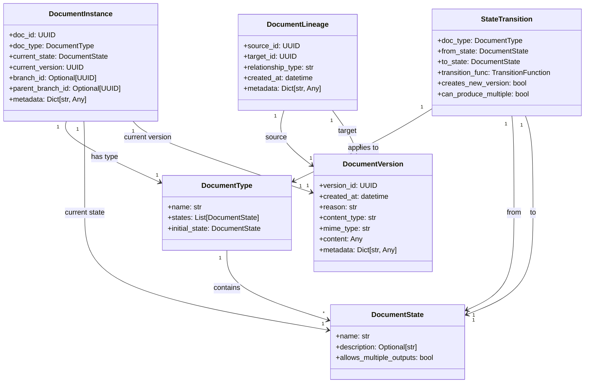
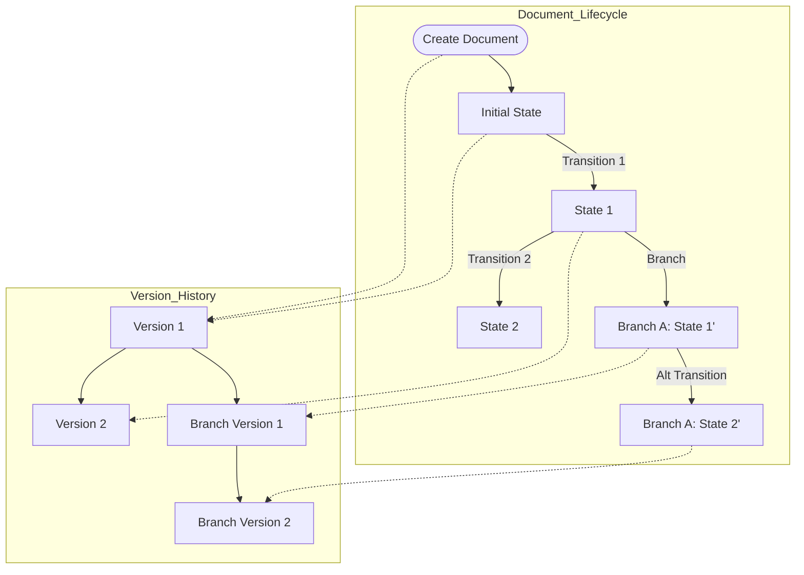

# System Patterns: Document State Management Module

## 1. Core Architecture

The document state management system follows a state machine pattern with persistence layer abstraction. Here's the architecture:

## 2. Key Design Patterns

### State Machine Pattern
- Documents have well-defined states (DocumentState)
- Transitions between states are explicitly defined
- Each document type has its own set of valid states
- Transition functions handle the state change logic

### Repository Pattern
- Persistence abstraction through interfaces
- Multiple implementation options (In-memory, SQLAlchemy)
- CRUD operations for document instances, versions, and lineage

### Dependency Injection
- Transition functions are injected rather than hardcoded
- Allows for flexible processing pipelines
- Consumers provide specific transition implementations

### Immutable Version History
- Each state change creates a new version
- Previous versions are preserved
- Complete document history is maintained

### Composite Pattern (Document Lineage)
- Documents can have parent-child relationships
- Multiple results can be produced from a single input
- Complex document trees can be modeled and traversed

### Branch Model
- Similar to Git's branching concept
- Alternative processing paths from the same base document
- Facilitates experimentation and comparison

## 3. Component Relationships

## 4. Data Flow

## 5. Key Technical Decisions

1. **Pydantic Models for Core Components**: Using Pydantic for data validation and serialization.

2. **SQLAlchemy ORM with PostgreSQL**: Primary persistence mechanism for production use.

3. **In-Memory Implementation**: For testing and lightweight use cases.

4. **UUID-Based Identity**: All entities use UUIDs for identification.

5. **Explicit State Transitions**: Transitions must be registered and are not implicit.

6. **Immutable Document History**: Previous versions are preserved and never modified.

7. **Branch-Based Experimentation**: Formal support for alternative processing paths.

8. **Multiple Output Documents**: State transitions can produce multiple results.

## 6. Extensibility Mechanisms

1. **Custom Document Types**: Define new document types with unique states and transitions.

2. **Pluggable Transition Functions**: Add custom processing logic through dependency injection.

3. **Alternative Persistence Implementations**: Implement PersistenceInterface for different storage solutions.

4. **Metadata Enrichment**: Both documents and relationships support flexible metadata.

5. **Branching Strategy**: Create custom branching strategies for different processing needs.
