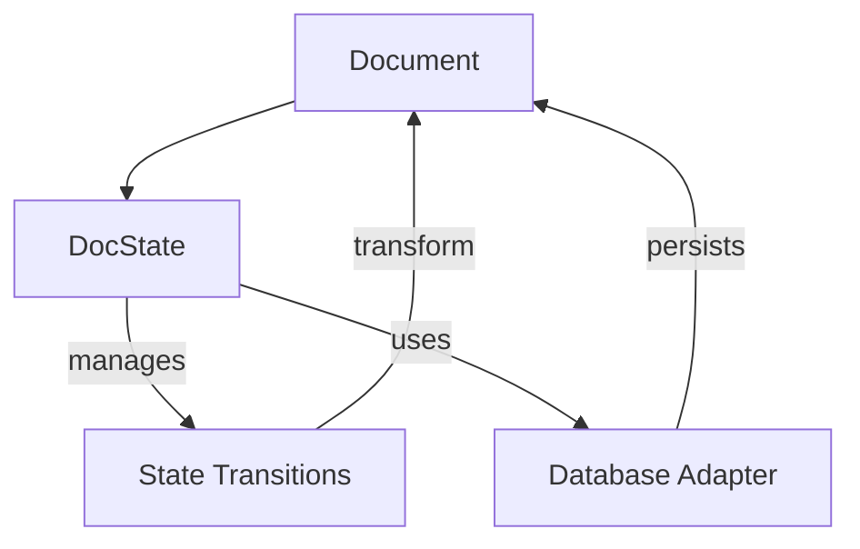
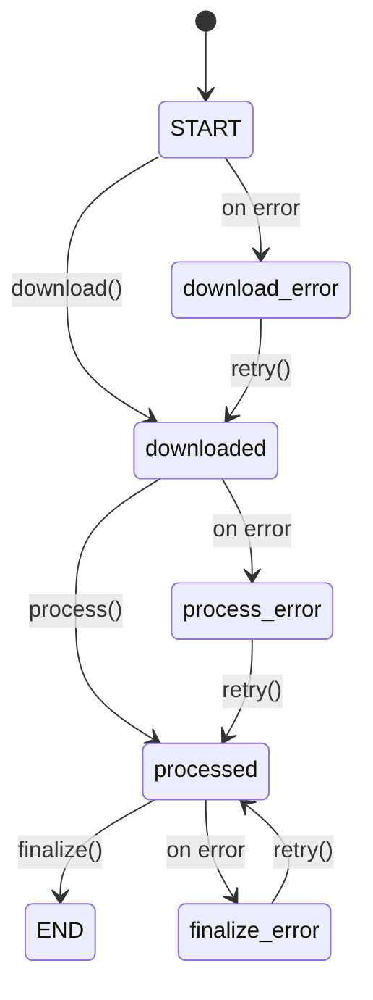
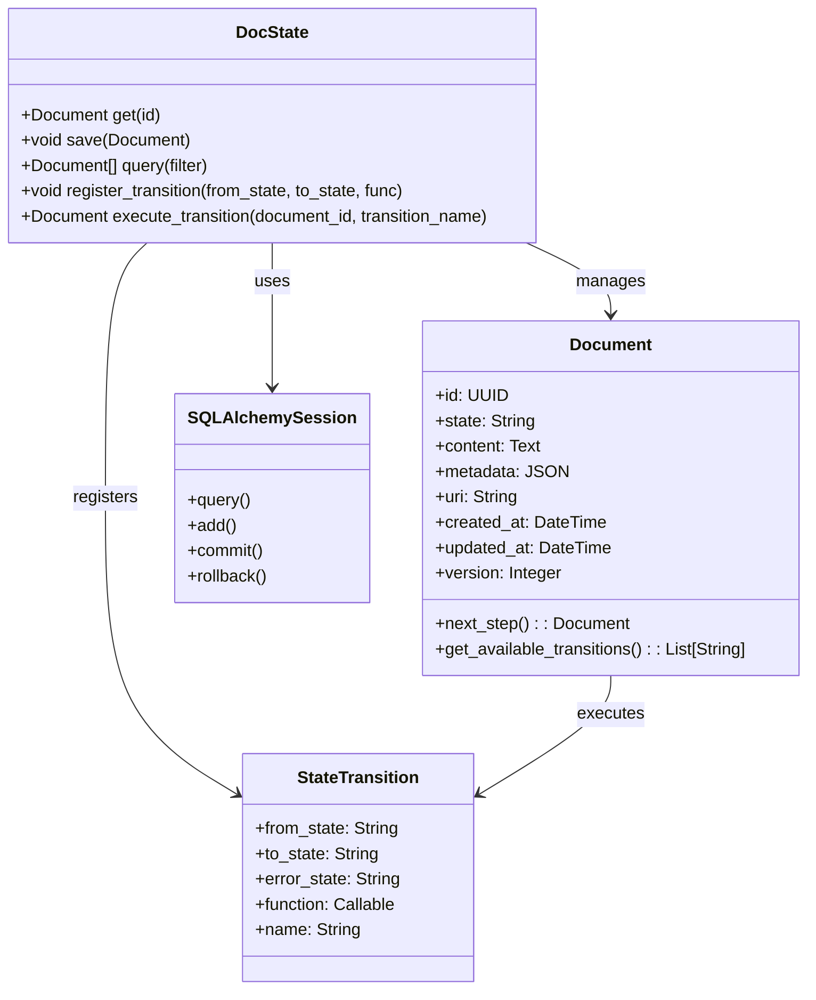
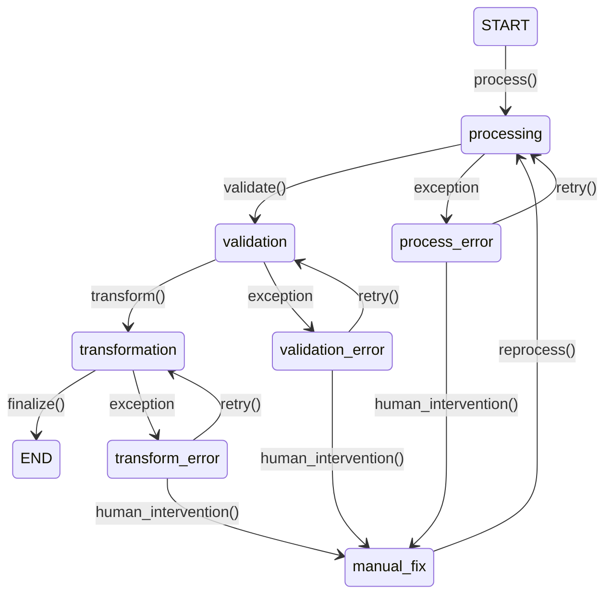
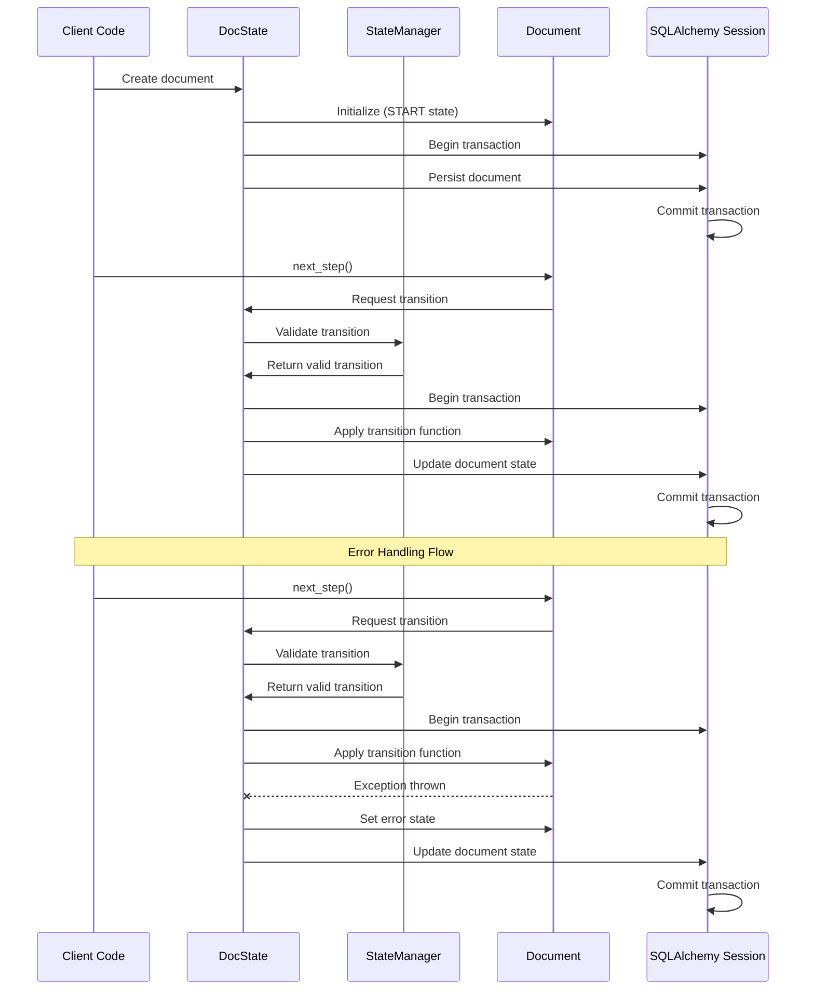

# DocState System Patterns

## Architecture Overview

DocState is built on a robust state machine architecture, forming the core of its document processing capabilities. This is combined with a decorator pattern to create a clean, declarative API. The system is designed around these core components:



## Core Design Patterns

### State Machine Pattern

The central pattern in DocState is the **State Machine Pattern**, which forms the foundation of the entire system. Each document has:

- A current state (represented as a string identifier)
- Defined transitions between states with clear rules
- Handlers for each transition with specific business logic
- Automatic state persistence via SQLAlchemy ORM

The state machine implementation follows these principles:
1. **Explicit States**: All possible document states are clearly defined
2. **Deterministic Transitions**: Each transition has a single resulting state (success or error)
3. **Atomicity**: State transitions are atomic database operations
4. **Observability**: All state changes are tracked and logged



### Decorator Pattern

The state machine is exposed through Python decorators, providing a clean, declarative API for defining transitions:

```python
@docs.transition(FROM_STATE, TO_STATE, error=ERROR_STATE)
def my_transition(document: Document) -> Document:
    # Process document
    return document
```

This pattern enables:
- Clear definition of state transitions
- Automatic registration of transition handlers with the state machine
- Runtime validation of transition rules and constraints
- Minimal boilerplate code for complex state logic
- Automatic transaction management via SQLAlchemy

### Repository Pattern with SQLAlchemy

Document persistence uses the **Repository Pattern** implemented with SQLAlchemy ORM to abstract database operations:



### Factory Pattern

The DocState instance acts as a factory for creating new documents with proper state initialization:

```python
# DocState as a factory
doc = docs(uri='https://example.com')
```

This pattern:
- Simplifies document creation with proper initial state
- Ensures consistent database persistence through SQLAlchemy
- Handles transaction management for document creation
- Registers the document with the state machine

## State Machine Error Handling

DocState's state machine includes a sophisticated error handling system:



Key aspects:
- Each transition declaratively specifies its error state
- Exceptions during processing automatically transition to the appropriate error state
- SQLAlchemy transactions ensure database consistency during errors
- Error recovery paths can be implemented through dedicated error handling transitions
- Retry policies with exponential backoff for transient failures

## State Machine Components

The DocState state machine consists of these interrelated components:

### Document Entity (SQLAlchemy Model)

- Core data structure containing:
  - Document content and metadata
  - Current state identifier
  - State transition history
  - SQLAlchemy model definition with appropriate indexes

### StateManager Controller

- Core state machine implementation
- Manages state transition graph and rules
- Validates state transitions for correctness
- Prevents invalid state transitions
- Maintains state transition registry

### DocState Controller

- Main interface for interacting with documents
- Delegates to StateManager for transition logic
- Handles document persistence via SQLAlchemy
- Provides transition decorator API
- Manages transactions and atomicity

### Transition Functions

- User-defined functions that implement business logic
- Transform documents from one state to another
- Decorated with @docs.transition
- May include validation logic

### SQLAlchemy Integration

- Maps Document objects to database tables
- Manages database transactions for state changes
- Handles schema migrations via Alembic
- Provides query interface for document filtering

## State Machine Data Flow

The state machine data flow through the system follows this sequence:



## State Machine Concurrency Model

The state machine handles concurrent document processing through:

1. **Atomic State Transitions**: Each state change is an atomic SQLAlchemy transaction
2. **Optimistic Concurrency Control**: Version checking through SQLAlchemy prevents conflicting updates
3. **Isolated Document Context**: Each document's state machine instance operates independently
4. **Transaction Isolation**: SQLAlchemy's session isolation prevents race conditions
5. **State Locking**: Optional pessimistic locking for critical document transitions

## State Machine Extension Points

The state machine is designed with these key extension points:

1. **Custom Transition Hooks**: Pre/post transition hooks for cross-cutting concerns
2. **State Machine Middleware**: Intercept state transitions for logging, validation, or metrics
3. **Custom State Validators**: Define rules that validate state transitions
4. **State Change Event Subscribers**: React to document state changes with callbacks
5. **Custom Document Classes**: Extend the base Document class with domain-specific behavior
6. **Transition Groups**: Define common transitions that can be applied to multiple document types
7. **State Machine Visualizers**: Generate visual representations of state machines
