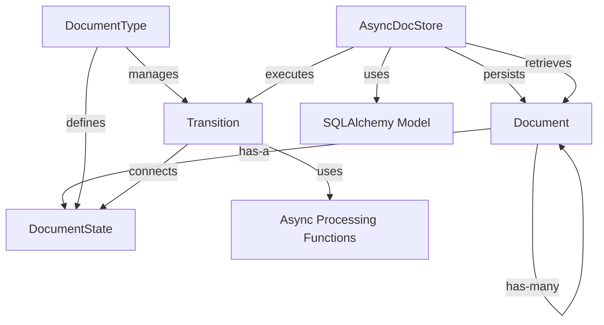

# System Patterns: Document Processing Pipeline

## System Architecture
The document processing system is built around a state machine architecture with the following key components:

## Key Technical Decisions
1. **State Machine Pattern**: Documents progress through well-defined states (link → download → chunk → embed) with explicit transitions between states. Final states are identified as those with no outgoing transitions.
2. **Repository Pattern**: The AsyncDocStore acts as a repository for Document objects, providing CRUD operations and specialized queries.
3. **Fully Asynchronous Processing**: All document processing functions are implemented as async functions for improved performance and scalability.
4. **Parent-Child Relationships**: Documents maintain relationships to track lineage, especially important for chunking where one document becomes many.
5. **SQLAlchemy ORM with Async Support**: Persistence layer uses SQLAlchemy with async extensions for database interactions.
6. **Immutable State Transitions**: Each state transition creates new document(s) rather than modifying existing ones, preserving processing history.
7. **Connection Pooling**: Optimized database connection management with configurable pool settings.
8. **Concurrency Control**: Built-in limits on concurrent processing to prevent resource exhaustion.
9. **Streaming Support**: Large document content can be streamed in chunks to handle documents of any size efficiently.
10. **Optimized Query Patterns**: Database indexes and query optimizations for common access patterns.

## Design Patterns in Use
1. **State Pattern**: DocumentState represents different states a Document can be in, with state-specific behavior encapsulated in transition functions.
2. **Factory Method**: Document creation through the AsyncDocStore, which manages IDs and relationships.
3. **Strategy Pattern**: Processing functions implement different strategies for transforming documents based on their current state.
4. **Repository Pattern**: AsyncDocStore abstracts the persistence and retrieval of Document objects.
5. **Pipeline Pattern**: The sequence of state transitions forms a processing pipeline for documents.
6. **Metadata Pattern**: Document objects carry metadata about their processing history and relationships.
7. **Decorator Pattern**: The `@async_timed()` decorator for performance monitoring.
8. **Caching Pattern**: LRU caches and in-memory state caching for improved performance.
9. **Batch Processing Pattern**: Support for processing multiple documents in a single operation.
10. **Command Pattern**: Transition processing functions encapsulate operations as executable commands.

## Component Relationships

### Document
- Core entity with properties including ID, state, content, media_type, url, parent/child relationships, and metadata
- Contains references to parent document (if derived) and child documents (if it generated others)
- Implemented as a Pydantic BaseModel for validation and serialization
- Tracks its own state as a string that corresponds to a DocumentState name
- Provides methods for managing children relationships efficiently

### DocumentState
- Represents a specific state in the document lifecycle (link, download, chunk, embed)
- Immutable value object identified by name
- Implements equality comparison with both DocumentState objects and strings
- Hashable for use in collections
- Uses LRU cache for string representation for better performance

### DocumentType
- Defines the state machine for a type of document
- Contains all possible states and valid transitions between them
- Provides methods to retrieve possible transitions from a given state
- Identifies final states (terminal states with no outgoing transitions)
- Implements caching for transitions and final states for improved performance
- Validates that all transitions reference valid states

### Transition
- Connects two DocumentStates (from_state and to_state)
- Associates a processing function that transforms a document from one state to another
- Represents a single step in the document processing pipeline
- Processing function is an async function that takes a Document and returns Document(s)
- Validates that the process_func is callable

### AsyncDocStore
- Manages persistence of Document objects via SQLAlchemy with async support
- Provides CRUD operations (add, get, update, delete) and specialized queries
- Handles the execution of state transitions with concurrency controls
- Maintains document relationships in the database
- Updates parent documents with references to their children
- Implements connection pooling for better performance
- Provides streaming capabilities for large document content
- Includes comprehensive error handling with custom error states
- Supports batch operations for improved efficiency
- Uses caching to improve performance of repeated operations

### Processing Functions
- Asynchronous functions have been fully implemented with error handling
- Each function is designed for a specific transition:
  - download_document: Fetches content from URLs using httpx with proper error handling
  - chunk_document: Splits documents into smaller pieces using paragraph and sentence-based chunking
  - embed_document: Creates vector embeddings using character frequency or integration with external embedding services
- Processing functions return new document(s) in the target state
- Error handling is built into processing functions to ensure pipeline continuity
- Metadata is preserved and enhanced at each transition

### Utility Functions
- Logging utilities for document operations, transitions, and processing
- Performance monitoring with the `@async_timed()` decorator
- Concurrency control with `gather_with_concurrency` for parallel processing
- Error handling utilities for async tasks
- Async-to-sync bridging utilities
