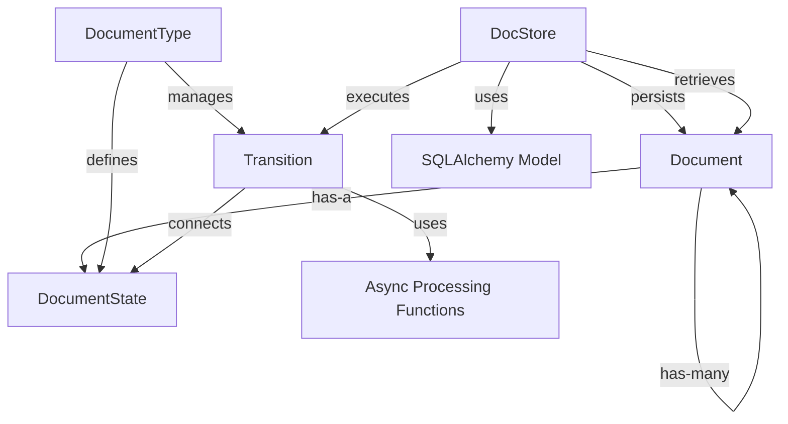

# System Patterns: Document Processing Pipeline

## System Architecture
The document processing system is built around a state machine architecture with the following key components:

## Key Technical Decisions
1. **State Machine Pattern**: Documents progress through well-defined states (link → download → chunk → embed) with explicit transitions between states. Final states are identified as those with no outgoing transitions.
2. **Repository Pattern**: The DocStore acts as a repository for Document objects, providing CRUD operations and specialized queries.
3. **Asynchronous Processing**: All document processing functions are implemented as async functions for improved performance and scalability.
4. **Parent-Child Relationships**: Documents maintain relationships to track lineage, especially important for chunking where one document becomes many.
5. **SQLAlchemy ORM**: Persistence layer uses SQLAlchemy for database interactions and mapping between Document objects and database records.
6. **Immutable State Transitions**: Each state transition creates new document(s) rather than modifying existing ones, preserving processing history.

## Design Patterns in Use
1. **State Pattern**: DocumentState represents different states a Document can be in, with state-specific behavior encapsulated in transition functions.
2. **Factory Method**: Document creation through the DocStore, which manages IDs and relationships.
3. **Strategy Pattern**: Processing functions implement different strategies for transforming documents based on their current state.
4. **Repository Pattern**: DocStore abstracts the persistence and retrieval of Document objects.
5. **Pipeline Pattern**: The sequence of state transitions forms a processing pipeline for documents.
6. **Metadata Pattern**: Document objects carry metadata about their processing history and relationships.

## Component Relationships

### Document
- Core entity with properties including ID, state, content, media_type, url, parent/child relationships, and metadata
- Contains references to parent document (if derived) and child documents (if it generated others)
- Implemented as a Pydantic BaseModel for validation and serialization
- Tracks its own state as a string that corresponds to a DocumentState name

### DocumentState
- Represents a specific state in the document lifecycle (link, download, chunk, embed)
- Immutable value object identified by name
- Implements equality comparison with both DocumentState objects and strings
- Hashable for use in collections

### DocumentType
- Defines the state machine for a type of document
- Contains all possible states and valid transitions between them
- Provides methods to retrieve possible transitions from a given state
- Has a property to identify final states (terminal states with no outgoing transitions)

### Transition
- Connects two DocumentStates (from_state and to_state)
- Associates a processing function that transforms a document from one state to another
- Represents a single step in the document processing pipeline
- Processing function is an async function that takes a Document and returns Document(s)

### DocStore
- Manages persistence of Document objects via SQLAlchemy
- Provides CRUD operations (add, get, update, delete) and specialized queries (by state, ID)
- Handles the execution of state transitions via the `next()` method, which accepts either a single `Document` or a `List[Document]` as input and returns a list of resulting documents.
- Maintains document relationships in the database
- Updates parent documents with references to their children when new documents are created

### Processing Functions
- Asynchronous functions have been fully implemented with error handling
- Each function is designed for a specific transition:
  - download_document: Fetches content from URLs using httpx with proper error handling
  - chunk_document: Splits documents into smaller pieces using paragraph and sentence-based chunking
  - embed_document: Creates vector embeddings (currently using character frequency as placeholder)
- Processing functions return new document(s) in the target state
- Error handling is built into processing functions to ensure pipeline continuity
- Metadata is preserved and enhanced at each transition
