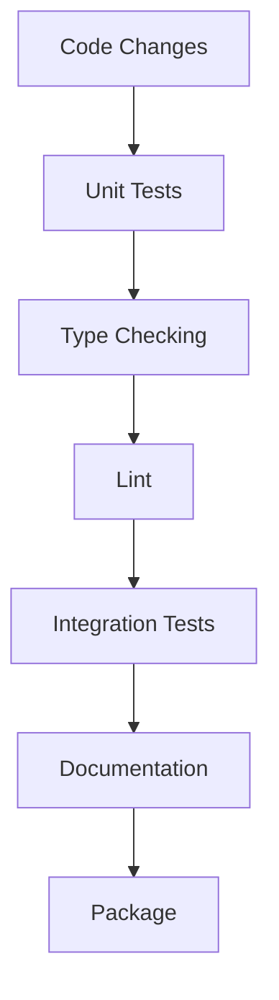

# DocState Technical Context

## Technology Stack

DocState is built using the following technology stack:

### Core Technology

- **Python 3.12+**: Primary implementation language, utilizing latest Python features
- **Type Hints**: Extensive use of Python's type hinting for better developer experience
- **Decorators**: Leveraging Python's decorator pattern for a clean API

### Database Support

DocState uses SQLAlchemy as its ORM with Alembic for database migrations:

- **SQLAlchemy**: Provides robust ORM capabilities and SQL abstraction
- **Alembic**: Handles database schema migrations and version control
- **PostgreSQL**: Primary supported database
- **SQLite**: For development and testing environments

### Dependencies

#### Core Dependencies
- **pydantic**: For document schema validation and type checking
- **sqlalchemy**: For ORM and database operations
- **alembic**: For database migrations and schema versioning
- **tenacity**: For retry logic in error handling

#### Integration Dependencies
- **requests**: For HTTP operations (in download transitions)
- **aiohttp** (optional): For async HTTP operations
- **google-generativeai**: For Gemini AI integration
- **transformers** (optional): For Hugging Face model support
- **langchain** (optional): For complex LLM pipelines

## Development Environment

### Tooling

- **uv**: Fast dependency management and packaging (replacing Poetry)
- **pytest**: Testing framework
- **mypy**: Static type checking
- **black**: Code formatting
- **isort**: Import sorting
- **flake8**: Linting
- **sphinx**: Documentation generation

### Development Workflow



## Implementation Constraints

### Performance Considerations

- **Memory Usage**: Document content can be large, requiring careful memory management
- **Database I/O**: Frequent state transitions require efficient database operations
- **Concurrency**: Multiple documents may be processed simultaneously

### Security Constraints

- **Input Validation**: All document inputs must be validated
- **Database Access**: Connection strings should be securely managed
- **External Services**: Integration with external services (like LLMs) requires secure API handling

### Scalability Requirements

- **Horizontal Scaling**: Multiple instances can process documents independently
- **Throughput**: System designed to handle high document processing volumes
- **Backpressure**: Mechanisms to handle processing backlog

## Technical Interfaces

### API Design

```python
# Core API Example
from docstate import DocState, Document, START, END

# Initialize
docstate = DocState(connection_string)

# Define transitions
@docstate.transition(START, "processed", error="process_error")
def process_document(doc: Document) -> Document:
    # Process logic
    return doc

# Create document
doc = docstate(uri="https://example.com")

# Execute transition
doc.next_step()
```

### Database Schema

The system requires these core tables/collections:

#### Document Collection
```json
{
  "id": "uuid",
  "state": "string",
  "content": "text/binary",
  "metadata": "json",
  "uri": "string",
  "created_at": "timestamp",
  "updated_at": "timestamp",
  "version": "integer"
}
```

#### Transition History Collection
```json
{
  "id": "uuid",
  "document_id": "uuid",
  "from_state": "string",
  "to_state": "string",
  "transition_name": "string",
  "executed_at": "timestamp",
  "duration_ms": "integer",
  "success": "boolean",
  "error_message": "string (optional)"
}
```

## Testing Strategy

### Unit Testing

- Test each transition function in isolation
- Mock database interactions
- Test error handling paths

### Integration Testing

- Test complete document processing pipelines
- Use in-memory or containerized databases
- Verify database consistency after transitions

### Performance Testing

- Measure throughput for different document sizes
- Test concurrent document processing
- Identify bottlenecks in state transitions

## Deployment Model

### Package Distribution

- PyPI package distribution
- Docker image for containerized deployment
- GitHub repository for source distribution

### Runtime Environment

- Supports cloud, on-premises, and local development
- Works with serverless environments (AWS Lambda, Google Cloud Functions)
- Compatible with container orchestration (Kubernetes)

### Monitoring and Observability

- Built-in logging with structured output
- Prometheus metrics integration (optional)
- OpenTelemetry traces (optional)

## Technical Roadmap

### Short-term Technical Goals

1. Stable core API with minimal dependencies
2. PostgreSQL and MongoDB adapters
3. Basic error handling and retry logic
4. Comprehensive test suite
5. Integration with Gemini and other popular LLMs

### Long-term Technical Investments

1. Async/await support for non-blocking operations
2. Distributed document processing with Redis/Kafka
3. Web dashboard for monitoring document states
4. Plugin system for custom transition behaviors
5. Integration with popular ETL frameworks
