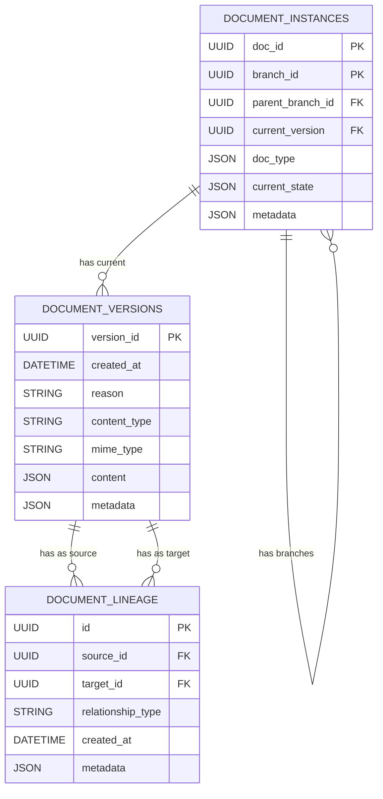

# Technical Context: Document State Management Module

## 1. Technologies Used

### Core Technologies
- **Python 3.8+**: The primary programming language for the module
- **Pydantic**: Used for data validation, serialization, and documentation
- **SQLAlchemy**: ORM for database interactions
- **PostgreSQL**: Primary production database (with SQLite support for testing)
- **UUID**: For unique identification of documents, versions, and branches
- **pytest**: For comprehensive testing of the module

### Key Python Libraries
- **typing**: For type annotations and improved code readability
- **datetime**: For timestamp tracking in version history
- **json**: For handling JSON data in document content
- **abc**: For defining abstract interfaces

## 2. Development Setup

### Required Environment
- Python 3.8 or higher
- PostgreSQL database (for production use)
- SQLite (for development/testing)

### Development Dependencies
- pytest for testing
- SQLAlchemy-Utils for UUID type support
- Any specific libraries needed for document processing (injected by consumers)

### Installation & Configuration
- Package installable via pip/poetry/other package managers
- Configuration primarily through code (document types, states, transitions)
- Database connection via SQLAlchemy connection strings

## 3. Technical Constraints

### Performance Considerations
- **Version History Storage**: As documents progress through states, version history can grow large
- **Document Lineage Traversal**: Complex document trees may be expensive to traverse
- **Database Connection Management**: Need to manage connection pools efficiently

### Compatibility Requirements
- Support for both PostgreSQL and SQLite
- Compatibility with different Python environments
- Handling of various document content types and formats

### Scalability Limitations
- In-memory implementation suitable only for small-scale use
- PostgreSQL implementation should handle large document volumes
- Complex branching strategies may create performance bottlenecks

### Security Considerations
- No built-in authentication or authorization
- Assumes secure database access
- Document content security handled by consumers

## 4. Dependencies

### Direct Dependencies
- **Pydantic**: For model definitions, validation, and serialization
- **SQLAlchemy**: For ORM and database interactions
- **SQLAlchemy-Utils**: For specialized column types
- **pytest**: For testing framework

### Optional Dependencies
- PostgreSQL driver (psycopg2 or psycopg2-binary)
- SQLite driver (included in Python standard library)

### Dependency Injection Points
- **State Transition Functions**: Must be provided by consumers
- **Document Content Processing**: Handled externally to this module
- **Custom Persistence Layer**: Can be implemented by extending PersistenceInterface

## 5. Database Schema

The SQLAlchemy models define the following database schema:

## 6. Technical Trade-offs

### Pydantic vs. Dataclasses
- Pydantic chosen for validation and serialization capabilities
- Slightly more overhead than dataclasses but better validation

### SQLAlchemy vs. Raw SQL
- ORM approach for better maintainability and code organization
- May have performance implications for complex queries

### In-Memory vs. Persistent Storage
- Both implementations provided for flexibility
- Trade-off between simplicity and durability

### UUID vs. Sequential IDs
- UUIDs chosen for global uniqueness and distributed generation
- Larger storage footprint but better for distributed systems

### JSON Storage vs. Structured Columns
- Complex objects stored as JSON for flexibility
- Simplifies schema at cost of query capabilities

## 7. Technical Roadmap Considerations

### Potential Future Enhancements
- **Async Support**: Add async versions of persistence interfaces
- **Migration Tools**: For evolving document types and states
- **Bulk Operations**: For improved performance with large datasets
- **Caching Layer**: For frequently accessed documents
- **Schema Evolution**: Support for changing document schemas over time
- **Event System**: For notifications on state changes
